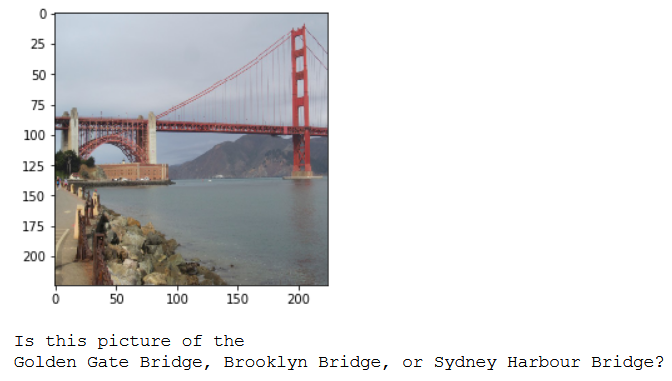

## Project Overview

Build a pipeline to process real-world, user-supplied images.
Given an image, and predict the most likely locations where the image was taken.

## Project Instructions

### Instructions
1. Install requirements: pytorch, numpy, matplotlib, opencv
2. Download the dataset included below in the "Dataset Info" section.
3. Train CNNs in PyTorch (VGG-19).

## (Optionally) Accelerating the Training Process 

If your code is taking too long to run, you will need to either reduce the complexity of your chosen CNN architecture or switch to running your code on a GPU.

## Dataset Info

The landmark images are a subset of the Google Landmarks Dataset v2.
[this link](https://udacity-dlnfd.s3-us-west-1.amazonaws.com/datasets/landmark_images.zip).

License information for the full dataset [on Kaggle](https://www.kaggle.com/google/google-landmarks-dataset).