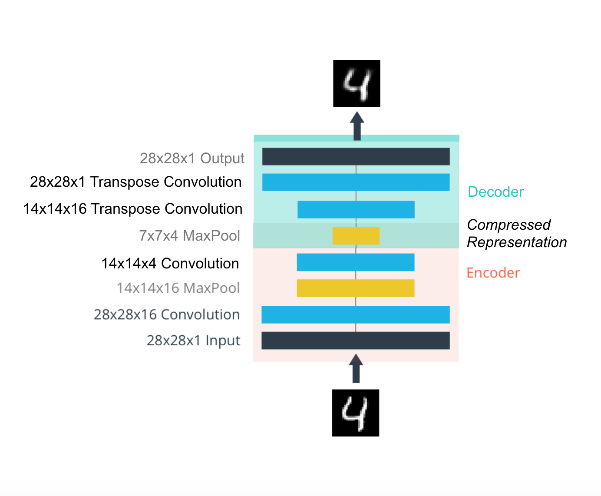

## Building a autoencoder to compress the MNIST dataset. 
With autoencoders, we pass input data through an encoder that makes a compressed representation of the input. Then, this representation is passed through a decoder to reconstruct the input data. Generally the encoder and decoder will be built with neural networks.

A compressed representation can be great for saving and sharing any kind of data in a way that is more efficient than storing raw data. In practice, the compressed representation often holds key information about an input image and we can use it for denoising images or oher kinds of reconstruction and transformation!

 

* Simple_Autoencoder_Solution.ipynb (Linear Autoencoder)

 

* Convolutional_Autoencoder_Solution.ipynb (Convolutional  Autoencoder)

* Denoising_Autoencoder_Solution.ipynb (Denoising Autoencoder)

* Upsampling_Solution.ipynb (Upsampling + Convolutions, Decoder)
