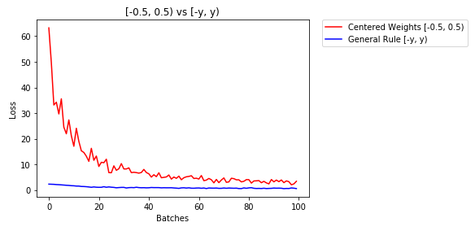
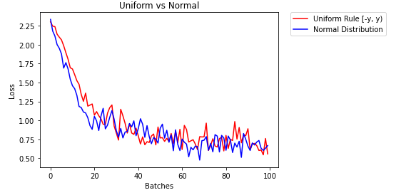

## Learn how to find good initial weights for a neural network
### Having good initial weights can place the neural network close to the optimal solution. This allows the neural network to come to the best solution quicker.

